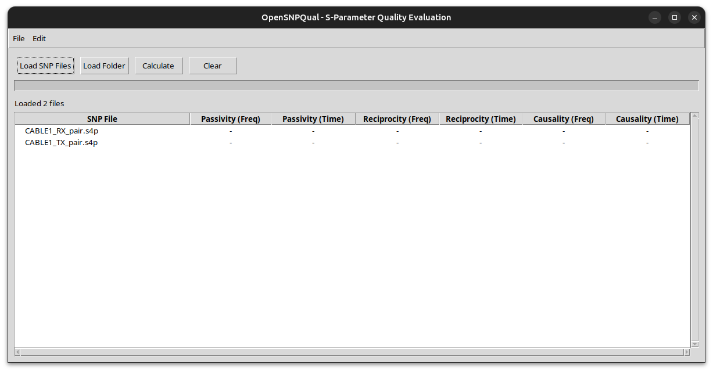
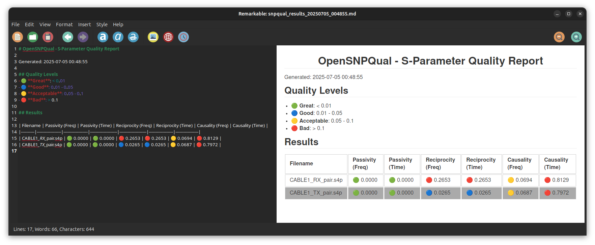

# openSNPQual
Easy to use S-parameter quality checker, with IEEE 370 implementations

**This code and repo is intended to be a TEST, to see how far we've come with the assistants that help to 'vibe code' a simple-ish tool.**

Please do let me know if you have constructive feedback or would like to contribute!

==Everything below this line is generated by Claude.ai "Claude Opus 4".== 

I'm *starting* to make edits, but it's a huge amount information to take in and process, will take time. For now, it runs and spits out some sort of result!

---


[](https://opensource.org/licenses/BSD-3-Clause)
[](https://www.python.org/downloads/)
[](https://github.com/yourusername/OpenSNPQual)

A utility tool for evaluating S-parameter (Touchstone) file quality based on IEEE P370 standards. OpenSNPQual provides both GUI and CLI interfaces to assess passivity, reciprocity, and causality metrics in frequency and time domains.





## 🚀 Features

- **Comprehensive S-parameter Analysis**
  - Passivity verification (|S| ≤ 1)
  - Reciprocity check (S_ij = S_ji)
  - Causality evaluation using Kramers-Kronig relations
  
- **Dual Domain Analysis**
  - Frequency domain metrics
  - Time domain validation
  
- **Multiple Interfaces**
  - User-friendly GUI with drag-and-drop support
  - Command-line interface for automation
  - Windows "Open with" integration
  
- **Rich Output Formats**
  - CSV export for data processing
  - Markdown reports with color-coded quality indicators
  - Clipboard support for Excel/PowerPoint integration

## 📊 Quality Metrics

| Level | Symbol | Threshold | Description |
|-------|--------|-----------|-------------|
| 🟢 Great | ✓ | < 0.01 | Excellent quality, suitable for critical applications |
| 🔵 Good | ○ | 0.01-0.05 | Good quality, acceptable for most applications |
| 🟡 Acceptable | △ | 0.05-0.1 | Marginal quality, may need attention |
| 🔴 Bad | ✗ | > 0.1 | Poor quality, requires correction |

## 📝 TODO

- [ ] Check the appropriate levels of "good, ok, acceptable, bad" against industry wide spread practices!! **HIGH PRIORITY**
- [ ] Validate output results against IEEE P370 MATLAB code!! **HIGH PRIORITY**
- [ ] Full IEEE P370 MATLAB integration
- [ ] Support for mixed-mode S-parameters (convert to SE using scikit-rf, or can work as is?)
- [ ] Batch processing improvements
- [ ] Advanced visualization options
- [ ] Web-based version, a big maybe
- [ ] API for programmatic access


## 🔧 Installation

### Option 1: Windows Executable (Recommended for Windows users)

1. Download the latest `OpenSNPQual.exe` from [Releases](https://github.com/yourusername/OpenSNPQual/releases)
2. Place in your desired directory
3. Optional: Add to PATH for command-line access

### Option 2: From Source

```bash
# Clone the repository
git clone https://github.com/yourusername/OpenSNPQual.git
cd OpenSNPQual

# Create virtual environment (recommended)
python -m venv venv
source venv/bin/activate  # On Windows: venv\Scripts\activate

# Install dependencies
pip install -r requirements.txt

# Run the application
python opensnpqual.py
```

### Option 3: Using pip (Coming soon)

```bash
pip install opensnpqual
```

## 📖 Usage

### GUI Mode

Launch the graphical interface:

```bash
# Using executable
OpenSNPQual.exe

# From source
python opensnpqual.py
```

**GUI Features:**
- **Load SNP Files**: Click to select one or multiple S-parameter files
- **Load Folder**: Process all S-parameter files in a directory
- **Calculate**: Analyze loaded files and display results
- **Copy Table**: Copy results to clipboard for Excel/PowerPoint
- **Export**: Save results as CSV or Markdown

**Windows Integration:**
Right-click any `.s*p` file → "Open with" → OpenSNPQual

### CLI Mode

Process files from command line:

```bash
# Basic usage
opensnpqual --cli -i input_files.csv

# With custom output prefix
opensnpqual --cli -i input_files.csv -o my_results

# Process specific files directly
opensnpqual --cli file1.s2p file2.s4p file3.s8p
```

**Input CSV Format:**
```csv
path/to/file1.s2p
path/to/file2.s4p
path/to/file3.s8p
```

**Output Files:**
- `{prefix}_result.csv` - Numerical results
- `{prefix}_result.md` - Formatted report with quality indicators

## 🛠️ Building from Source

### Windows

```batch
# Run the build script
build_windows.bat

# Or manually with PyInstaller
pyinstaller --onefile --windowed --name OpenSNPQual opensnpqual.py
```

### Linux/macOS

```bash
# Make build script executable
chmod +x build_unix.sh

# Run build script
./build_unix.sh

# Or manually
pyinstaller --onefile --windowed --name OpenSNPQual opensnpqual.py
```

## 🔬 Technical Details

### Implemented Metrics

1. **Passivity**
   - Frequency domain: Singular value decomposition check (max(σ) ≤ 1)
   - Time domain: Energy conservation validation

2. **Reciprocity**
   - Frequency domain: S_ij vs S_ji comparison
   - Time domain: Impulse response symmetry

3. **Causality**
   - Frequency domain: Kramers-Kronig relations
   - Time domain: Pre-cursor energy analysis

### Dependencies

- `numpy` - Numerical computations
- `pandas` - Data manipulation
- `scipy` - Signal processing
- `scikit-rf` - S-parameter file handling
- `tkinter` - GUI framework (included with Python)

## 🤝 Contributing

Contributions are welcome! Please feel free to submit a Pull Request. For major changes, please open an issue first to discuss what you would like to change.

1. Fork the repository
2. Create your feature branch (`git checkout -b feature/AmazingFeature`)
3. Commit your changes (`git commit -m 'Add some AmazingFeature'`)
4. Push to the branch (`git push origin feature/AmazingFeature`)
5. Open a Pull Request

## 🧪 Testing

```bash
# Run unit tests
python -m pytest tests/

# Run with coverage
python -m pytest --cov=opensnpqual tests/
```

## 🔗 Related Tools

- [scikit-rf](https://scikit-rf.org/) - RF/Microwave engineering toolkit
- [IEEE P370](https://www.ieee802.org/3/bj/public/tools.html) - Reference implementation
- [Simbeor](https://www.simberian.com/) - Commercial S-parameter analysis
- [Keysight PLTS](https://www.keysight.com/us/en/product/N1930B/physical-layer-test-system-plts-software.html) - Physical layer test system

## 📄 License

This project is licensed under the BSD 3-Clause License - see the [LICENSE](LICENSE) file for details.

## 🙏 Acknowledgments

- IEEE P370 Working Group for quality metric standards
- scikit-rf developers for the excellent S-parameter library
- Contributors and testers from the signal integrity community

## 📧 Contact

- **Author**: [Giorgi Maghlakelidze]
- **Email**: giorgi.snp [@] pm [DOT] me
- **LinkedIn**: [Your LinkedIn](https://linkedin.com/in/giorgim)
- **Issues**: [GitHub Issues](https://github.com/yourusername/OpenSNPQual/issues)

---

**Note**: This tool is intended for educational and professional use. While we strive for accuracy, always validate critical results with established commercial tools.

<p align="center">Made with ❤️ for the Signal Integrity Community</p>
