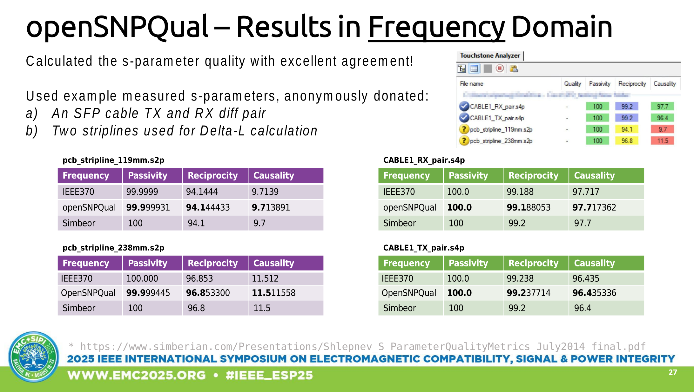
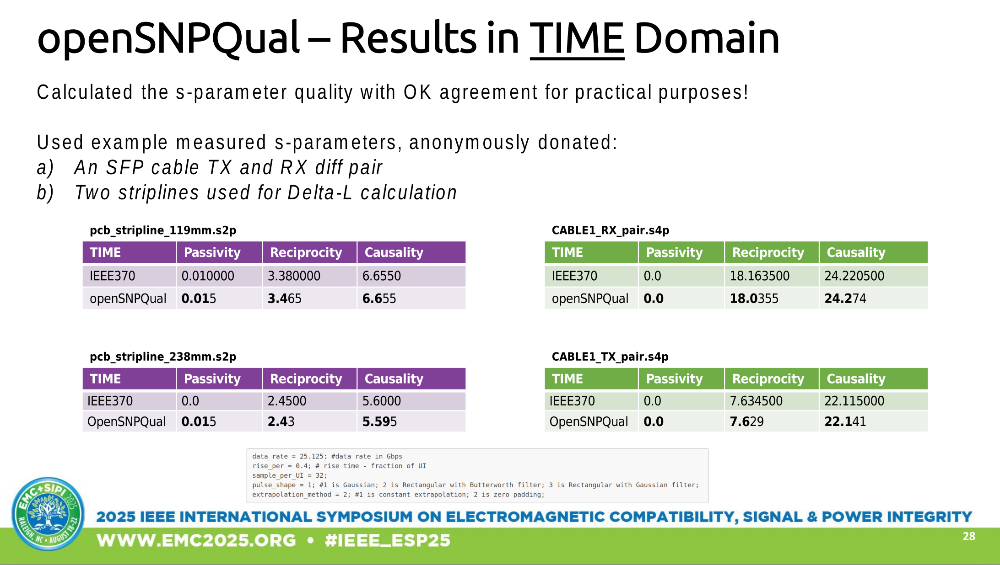

# Quality Metrics Calculated for The Example Touchstone Files

## Change log
**2025-08-14:** added correlation to IEEE370 Time Domain metrics.
Status:
CAUSALITY = perfect;
PASSIVITY = delta 0-50%, unclear;
RECIPROCITY = delta &lt; 2.5%, close enough for now. 

TODO: during debug, create_passive_matrix(), create_reciprocal_matrix(), create_causal_matrix() give the same output. However, get_time_domain_matrix() and inside it get_gaussian_pulse() doesn't give the same result. Something to do with indexing of G and GG arrays? Needs more work for more exact match.

**2025-08-02:** added correlation to IEEE370 Time Domain metric CAUSALITY including the Causality matrix, status: OK. Stripline S-parameters correlate. 

**2025-07-17:** added correlation to IEE370 Freq domain all metrics; status: OK. All 4 sample s-parameters correlate.

---

## Results validation and correlation presented in IEEE EMC + SIPI Symposium 2025

---
## pcb_stripline_119mm.s2p

Frequency domain result comparison:

| Method FREQ | Causality         | Passivity         | Reciprocity       |
|-------------|-------------------|-------------------|-------------------|
| IEEE370     | 9.7139            | 99.9999           | 94.1444           |
| OpenSNPQual | 9.713891          | 99.999931         | 94.144433         |

---

Time domain calculation settings:

	data_rate = 25.125; #data rate in Gbps
	rise_per = 0.4; # rise time - fraction of UI
	sample_per_UI = 32;
	pulse_shape = 1; #1 is Gaussian; 2 is Rectangular with Butterworth filter; 3 is Rectangular with Gaussian filter;
	extrapolation_method = 2; #1 is constant extrapolation; 2 is zero padding;
	

| Method TIME | Causality         | Passivity         | Reciprocity       |
|-------------|-------------------|-------------------|-------------------|
| IEEE370     | 6.655000          | 0.010000          | 3.380000          |
| OpenSNPQual | 6.655             | 0.015             | 3.465             |
   

#### Matrix: causality_time_domain_difference_mv

| IEEE370 | 1           | 2           |
|---------|-------------|-------------|
| 1       | 9.5960e-03  | 5.7716e-03  |
| 2       | 5.2785e-03  | 5.0836e-03  |
| OpenSNPQual | 1             | 2             |
| 1           | 9.593728e-03  | 5.771632e-03  |
| 2           | 5.279385e-03  | 5.083631e-03  |

reciprocity_time_domain_difference_mv =

   0,   6.7615e-03
   
   6.7615e-03,            0

passivity_time_domain_difference_mv =

   8.8767e-06   1.3961e-05
   
   1.3241e-05   8.8938e-06

## pcb_stripline_238mm.s2p

Frequency domain result comparison:

| Method Freq | Causality         | Passivity         | Reciprocity       |
|-------------|-------------------|-------------------|-------------------|
| IEEE370     | 11.512            | 100.000           | 96.853            |
| OpenSNPQual | 11.511558         | 99.999445         | 96.853300         |

---

| Method TIME | Causality         | Passivity         | Reciprocity       |
|-------------|-------------------|-------------------|-------------------|
| IEEE370     | 5.6000            | 0                 | 2.4500            |
| OpenSNPQual | 5.595             | 0.015             | 2.43              |

  
#### Matrix: causality_time_domain_difference_mv

| IEEE370 | 1           | 2           |
|---------|-------------|-------------|
| 1       | 7.7848e-03   | 5.0713e-03  |
| 2       | 4.2552e-03   | 4.7415e-03  |
| OpenSNPQual | 1             | 2             |
| 1           | 7.784144e-03  | 5.071260e-03  |
| 2           | 4.266165e-03  | 4.741466e-03  |

---
     

reciprocity_time_domain_difference_mv =

[   0,   4.8609e-03
   
   4.8609e-03,            0]

passivity_time_domain_difference_mv =

   7.1764e-06   1.3544e-05
   
   1.3108e-05   7.1819e-06

## CABLE1_TX_pair.s4p

Frequency domain result comparison:

| Method Freq | Causality         | Passivity         | Reciprocity       |
|-------------|-------------------|-------------------|-------------------|
| IEEE370     | 96.435            | 100.000           | 99.238            |
| OpenSNPQual | 96.435336         | 100.0             | 99.237714         |

---

| Method TIME | Causality         | Passivity         | Reciprocity       |
|-------------|-------------------|-------------------|-------------------|
| IEEE370     | 22.115000         | 0                 | 7.634500          |
| OpenSNPQual | 22.141            | 0.0               | 7.629             |

causality_time_domain_difference_mv =

   2.147883e-03   3.233397e-03   3.967204e-02   7.415210e-04
   3.278346e-03   2.860939e-03   7.337582e-04   3.464088e-02
   3.962427e-02   6.595213e-04   1.983229e-03   3.776137e-03
   6.592310e-04   3.434343e-02   3.663997e-03   2.667230e-03

reciprocity_time_domain_difference_mv =

   0   0.00043262   0.00051463   0.00286152
   0.00043262            0   0.00057330   0.00330832
   0.00051463   0.00057330            0   0.01436441
   0.00286152   0.00330832   0.01436441            0

passivity_time_domain_difference_mv =

   1.507482e-16   4.063285e-16   2.607718e-16   2.833292e-16
   4.551401e-16   2.350829e-16   2.281160e-16   2.245276e-16
   2.472624e-16   1.974235e-16   1.820745e-16   3.162436e-16
   2.591534e-16   2.004887e-16   2.902546e-16   2.208360e-16

   
## CABLE1_RX_pair.s4p

Frequency domain result comparison:

| Method Freq | Causality         | Passivity         | Reciprocity       |
|-------------|-------------------|-------------------|-------------------|
| IEEE370     | 97.717            | 100.000           | 99.188            |
| OpenSNPQual | 97.717362         | 100.0             | 99.188053         |

---

| Method TIME | Causality         | Passivity         | Reciprocity       |
|-------------|-------------------|-------------------|-------------------|
| IEEE370     | 24.220500         | 0                 | 18.163500         |
| OpenSNPQual | 24.274            | 0.0               | 18.0355           |

causality_time_domain_difference_mv =

   0.002223619   0.003577360   0.036285198   0.001495882
   0.003540599   0.002536776   0.001452279   0.041431923
   0.036234422   0.001345274   0.002356269   0.004775133
   0.001419543   0.041117783   0.008462383   0.002821627

reciprocity_time_domain_difference_mv =

   0   0.00081056   0.00214610   0.00271088
   0.00081056            0   0.00068235   0.00376632
   0.00214610   0.00068235            0   0.03571508
   0.00271088   0.00376632   0.03571661            0

passivity_time_domain_difference_mv =

   2.404695e-16   3.498416e-16   2.486646e-16   2.496979e-16
   3.799609e-16   1.989213e-16   1.828020e-16   2.022581e-16
   2.614300e-16   2.448772e-16   1.800309e-16   3.221946e-16
   3.622211e-16   1.895685e-16   3.493760e-16   1.680196e-16
